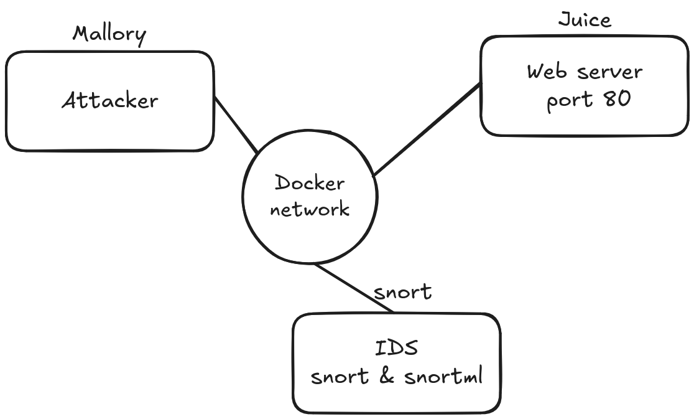

# Readme NGS-IDS

## Installation

Dans un terminal entrer : 

```bash
git clone [https://github.com/MaesMM/AI-IDS.git](https://github.com/MaesMM/AI-IDS.git)
cd AI-IDS/lab/snort
docker-compose up -d
```

Pour se connecter au container : 

```bash
docker ps #liste les container actifs
docker exec -it <container name> bash --login
```

## Architecture :



## Lancement de snort dans la console

```bash
cd /usr/local/snort/etc/snort
snort -c snort.lua -v -A console
```